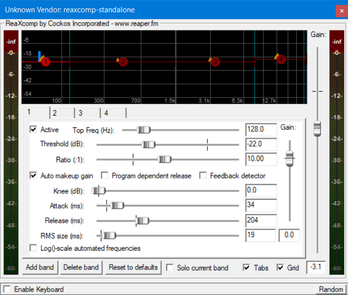
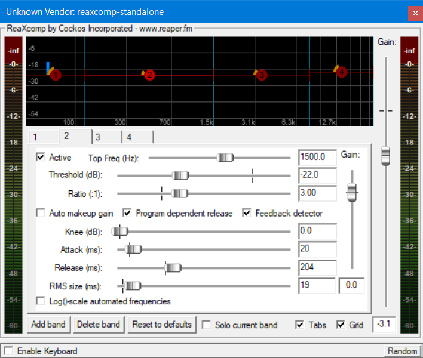
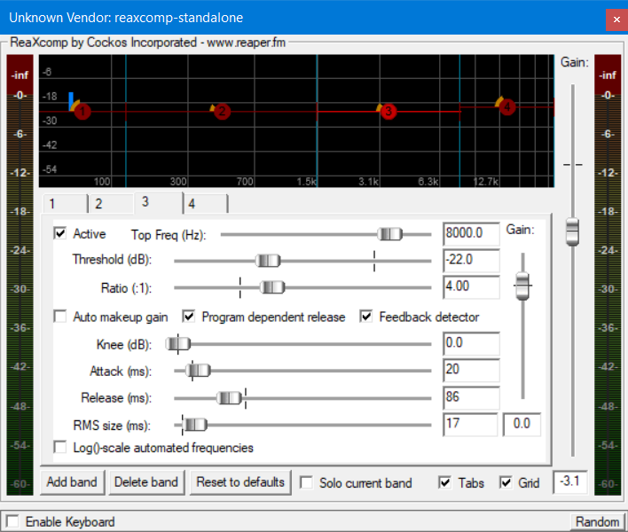
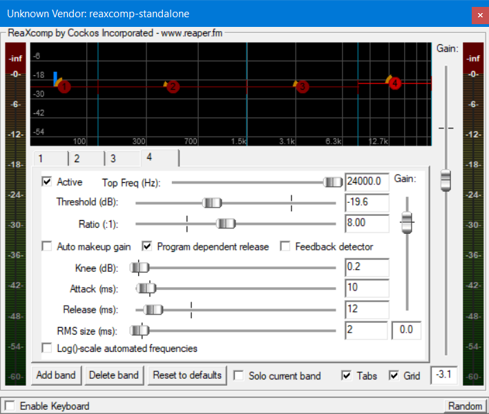
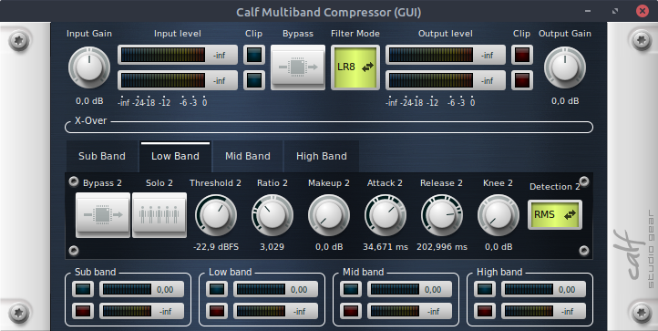
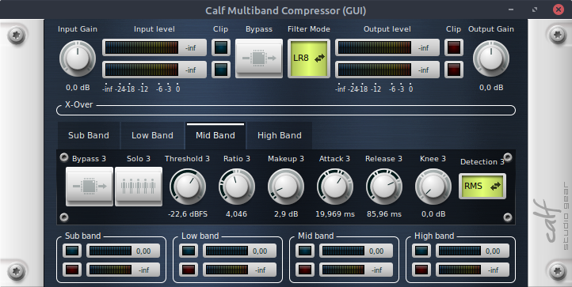
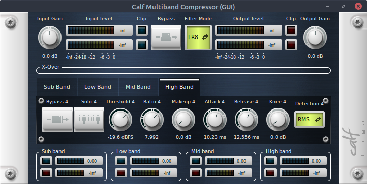
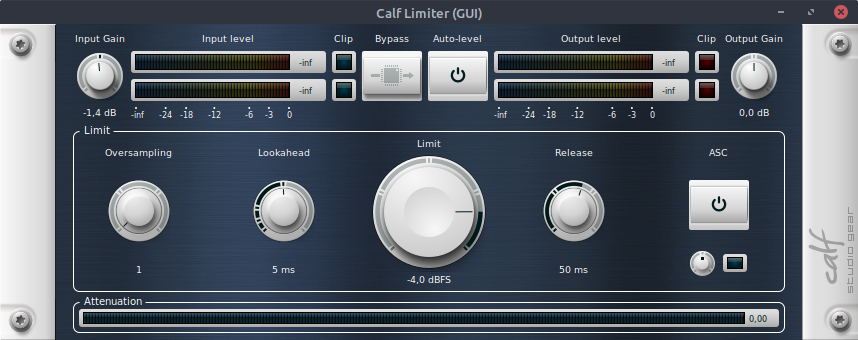
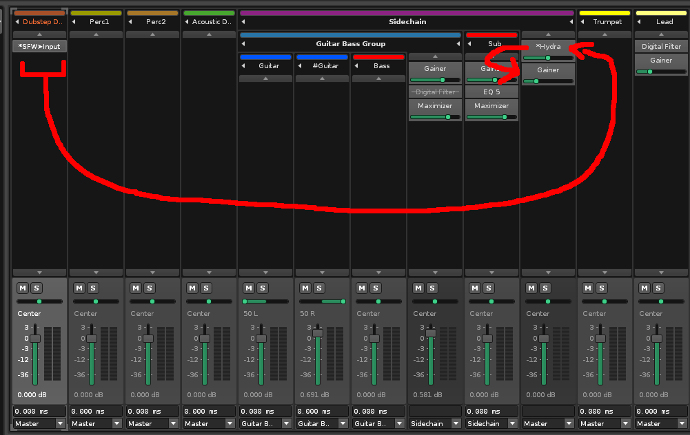
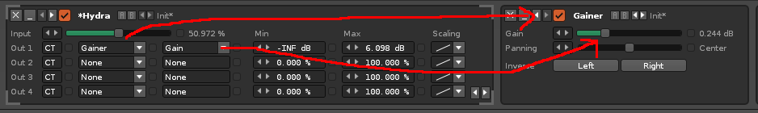

# Mixing


[Home](howto.md)

<!--toc:start-->
- [Mixing](#mixing)
  - [My ways of mixing and mastering](#my-ways-of-mixing-and-mastering)
    - [Mastering chain - On Windows and Linux:](#mastering-chain-on-windows-and-linux)
    - [Mastering chain - On Linux:](#mastering-chain-on-linux)
        - [Short explanation of KX repositories:](#short-explanation-of-kx-repositories)
      - [Track order:](#track-order)
    - [Mixing instruments](#mixing-instruments)
      - [Guitar and Bass](#guitar-and-bass)
      - [Drums and Percussions](#drums-and-percussions)
      - [Sidechain with a signal follower (here in Renoise)](#sidechain-with-a-signal-follower-here-in-renoise)
      - [Trumpets](#trumpets)
      - [Strings and Pads:](#strings-and-pads)
      - [Dubstep sounds and growls](#dubstep-sounds-and-growls)
<!--toc:end-->

## My ways of mixing and mastering

Mixing is an essential part in music production - it manages to balance audio to its right volume and frequencies so the whole song sounds well balanced. On this page, I want to share my mixing techniques of mixing and what I have learned over all these years.


> [!NOTE]
> I am not a professional audio engineer. My skills in that area is limited and based on personal preferences, try & error and tutorials from all over the web. However, if you may want to achieve a similar sound, follow these steps. Mixing is very niggling though, it could sound completely bad with your recordings.

**My current mastering setup:**

My master chain consists of an EQ, a limiter and a Multiband Compressor. Around Janury 2021, I aimed for a stronger low end with a decent amount of highs and a softer mid range area. Especially in heavier genres like metal and dubstep, bass can make the difference.

You can recreate my chain easily on Windows or Linux. On Windows I use ReaPlugins, which you can [download for free here](https://www.reaper.fm/reaplugs/). On Linux, I use Calf plugins, powered by Carla from the [KX repositories](https://kx.studio/Repositories).

> [!NOTE]
> Update from 2026: Reaper is officially supported under Linux. The FX chain from Reaper can now be simply applied on Linux as well, if you are using Reaper. There is no need for the KX repositories anymore if you are fine enough with the built-in tools.

### Mastering chain using Reaper

On Windows you just need to download the free [ReaPlugins](https://www.reaper.fm/reaplugs/). If you install it with the basic settings, it is going to be installed into `C:\Programs\VSTplugins\`



<details>
  <summary>The other ReaXComp band settings:</summary>





   

</details>

These are my settings. A Multiband splits usually 3 or more parts of the whole frequency spectrum, where you can then control the compression of its area. This is what can enhances bass in your songs - not (only) an EQ. (This is what people do when you stumble across "Bass Bosted" remixes on Youtube).

I use these settings for quite some time and I am still pleased. **Please note** that this can vary from style to arrangement; it could be that this mastering chain might not sound any good for your song. Here are my settings: If you have your own mutliband compression, they should have similar options:

| Band         | Top Freq(Hz) | Threshold (dB) | Ratio (:1) | Knee (dB) | Attack (ms) | Release (ms) | Auto makeup gain |
|--------      |-----         |-----           |----        |---        |----         |-----         |---               |
| 1: Sub       | 128          | -22            | 10         | 0         | 34          | 204          | ✓                |
| 2: Low-Mid   | 1500         | -22            | 3          | 0         | 20          | 204          | x                |
| 3: High-Mid  | 8000         | -22            | 4          | 0         | 20          | 86           | x                |
| 4: Treble    | 24000        | -19,6          | 8          | 0,2       | 10          | 12           | x                |

If you are also using Reaper, you can download the effect mastering chain as a Track Template right here:
[Reaper Mastering Chain v1](assets/mastering_chain_v1.RfxChain)

### Mastering chain using KX repositories:

##### Short explanation of KX repositories:

KX repositories are basically a collection of free and opensource audio plugins and applications. This repo is neither enabled by default nor are (most of) the plugins available on the offical servers from Ubuntu.  
If you run a debian based Linux distribution like Linux Mint or Ubuntu, just go the KX repositories link and execute the four commands shown on the site. After that, you might want to run another `sudo apt update` if the next step is not working. This functions to update the new repo.

You can then go to the [KX Plugins](https://kx.studio/Repositories:Plugins) page, where you see a list of all plugins available. Doing that is very simple: You just need the package(s) name you need

```bash
sudo apt install carla calf-plugins
# example: sudo apt install PACKAGENAME
```

This is going to download Carla + Calf plugins that I use. Of course you can check out all the other cool plugins and audio applications as well if you wish. I highly recommend the synthesizer vitalium-vst!

Carla is the plugin host, that you are going to need to run more plugins in Linux. It helps handling all the plugin formats if your DAW does not support it natively. My DAW of choice is Renoise at the moment. It supports LADSPA format but not LV2. If your DAW does support it, you probably won't need Carla.


The settings here are similar but not exact the same. However, this is both my alternative chain as well as my standard-goto chain on Linux. As you can see in the picture, here you are not able to adjust the areas for example. They are predefined by Calf itself, which does not mean any bad. I just personally had to adjust these settings.

| Band       | Threshold (dB) | Ratio (:1) | Makeup (dB) | Attack (ms) | Release (ms) |
|----------- |--------        |--------    |-----        |----         |---------     |
| Sub Band:  | -18,4          | 10,011     | 7,9         | 34          | 204,988      |
| Low Band:  | -22,9          | 3,029      | 0           | 34,671      | 203          |
| Mid Band:  | -22,6          | 4,04       | 2,9         | 19,969      | 85,96        |
| High Band: | -19,6          | 8          | 0           | 10,23       | 12,556       |

The other Calf Multiband band settings:

<details>
  <summary>Calf Multiband band settings - click here</summary>





   

</details>

In addition, I like to put Calf Limiter before the multiband compression. This step is not needed but I do it because the whole routing in Renoise feels a bit different and I have more control over the dynamics.



#### Track order:

When I start a new fresh song, I generally start sorting the tracks a bit. I always start with the drums, which are seperated into more drum tracks:  

*   Acoustic Drum Set ([TMDK](http://themetalkickdrum.com) - free Metal Drumkit)
*   Samples, 
*   Percussion 1 (Hi hats, Claps, Crashes)
*   Percussion 2 (usually I load up here "Damage" from Kontakt, general percussion + (FX) Foleys
*   Sidechain Group (every following is inside this group)
  *   Guitar 1 + Guitar 2 (each has its own cab but the same amp)
  *   Bass + Sub (bass being a real bass guitar while sub mostly being a static sine tone or dense attack)
  *   Dubstep Growls Track
  *   Trumpet/Synth Leads (additionally with a distortion)
  *   Strings, Pads
  *   Other synths
  *   Other Instruments
  *   Low Pass Filter Track
  *   Effects like White Noise, SFX and more

### Mixing instruments

#### Guitar and Bass

Mixing guitar is always tricky. I tend to use the low end to make space for the bass guitar—removing all lows will make it sound less heavy. It often comes down to small frequency adjustments that make the difference. There is no real standard EQ setting I rely on, but I often reduce around 400–500 Hz. However, in my opinion, it always depends on the song.

The bass I currently use is the Kraken VST, which has a crunchy sound. I’ve noticed this helps a lot in supporting the guitar tone. Enhancing it further with an EQ also helps. If I feel like the bass needs more low end, I either use a regular EQ or a gainer that boosts volume and slightly distorts the signal. I try not to push the low end too much, since a bass is already naturally low-heavy.

Once I have my tones, I add another guitar for stereo width. I usually keep everything in mono for a “tighter” sound, but the second guitar plays the same riff with the same amp model, just with a different cab. Note that simply copying your rhythm guitar track can cause phasing issues, which usually sound bad unless you are intentionally going for that effect.

#### Drums and Percussions

Once the guitar tone is set, I move on to the electronic dubstep drums. I tend to use strong kicks and aggressive snares that are very loud. I prefer using raw samples that are already powerful enough so I don’t need much additional processing. In rare cases, I add a compressor to balance them, but depending on how the sidechain is set up, this is usually unnecessary.

This track also triggers the sidechain, which is essential when working with strong electronic drums. In Renoise, sidechaining is quite straightforward:

#### Sidechain with a signal follower (here in Renoise)

On your e-drum track, add a “Signal Follower” effect. This reacts to every output on the track. The signal can then be routed to another track and into a specific effect. You could route it directly to the mixer of the sidechain group, but I prefer routing it into “Hydra.” In Renoise, Hydra is essentially a macro that lets you control multiple parameters with one main control. This main control will now be driven by the signal follower from the drum track. Whenever the kick or snare plays, it should lower the volume.

Let’s summarize the FX chains:

* Signal Follower on E-Drum track  
* Hydra (macro FX) on the sidechain group track  
* Preferred volume plugin on the sidechain group track (in my case: Gainer)  



On the left, the Signal Follower sends a signal to Hydra, which then controls the mixer or the gainer. I prefer the gainer because it allows more flexibility with volume and lets me add distortion during drops. Controlling the mixer volume would also work.

The Signal Follower needs a small adjustment before use. The default setting mutes the sidechain constantly and opens it when drums play. We want the exact opposite. But first, let’s look at Hydra:



Starting from “Out 1”: “CT” means current track, so we are controlling an FX on the same track. The second column selects the FX plugin, and the third column controls a parameter (knob) of that plugin. If you haven’t added a gainer yet, you need to do so. In Renoise, you can also select the mixer in that column. In other DAWs, the process is similar but may differ slightly.

The min and max values define the volume range of the sidechain. The minimum should definitely be set to zero or \(-\infty \, \text{dB}\).

Now let’s look at the Signal Follower setup:


Starting with “Dest”: the value (e.g., 10) targets another track—select it accordingly. Then, as with Hydra, choose Hydra and its main knob, or select Mixer > Volume if you are controlling volume directly.

“Dest Min” represents the “off” state (when nothing is playing). Setting it around 50% is reasonable. If you set it to 100%, the gainer would also be at 100%, which could cause heavy clipping. “Dest Max” defines the value when drums are playing—in this case, it should be 0%, so the volume is reduced when triggered.

There are additional fine-tuning parameters I often adjust per song. “Attack” controls how quickly the signal responds. For sidechaining, I want the volume reduction to happen immediately due to the strong transients of the drums. “Release” should have some milliseconds to return to normal; setting it too fast can introduce unwanted clicks.

“Sensitivity” (if available) controls how strongly the sidechain affects the volume. In Renoise, around 90% is subtle, 70% is medium-strong, and lower values become very aggressive, creating a pronounced pumping effect. Since my drums are not heavily compressed, overly strong settings can sound harsh and unbalanced.

You can also adjust scaling, which changes how quickly the signal reduces versus how it releases. Depending on the track, one setting may sound better than the other—there’s no strict rule here.

These settings are a key part of shaping my sound.

I explained this section in detail because it was a major turning point for me. Moving from classic metal/rock mixing to metalstep mixing, EDM and dubstep taught me many new techniques. It became the perfect blend of my traditional metal tone with dubstep elements. If you’re not familiar with the genre, I hope this gives some insight into how I shape my sound.

All the other instruments:

The rest is fairly straightforward. To cut through the mix—especially alongside metal and synths—classic instruments need more gain, power, and bright high frequencies. I usually achieve this with distortion or exciters in addition to EQ. The EQ should always clean up noisy low ends, since recorded instruments often contain some background noise from microphones.

#### Trumpets

I typically apply reverb and distortion to trumpets. What I like most about good trumpet libraries is their flexibility—they can produce staccato, chopped, growling, and many other articulations. Well-recorded trumpet libraries (I use Session Horns Pro from Native Instruments) have a strong high-end presence, allowing them to cut through dense metal mixes.

For example, in my TF2 Final Remix album, I used only trumpets to maintain the TF2 vibe—they consistently stand out in the mix. Working with their articulations was especially enjoyable.

#### Strings and Pads

Strings and soft pads usually get reverb, delay, and sometimes phaser or flanger effects. They don’t need to cut through the mix as much—they mainly need to fill space. I often remove the low end entirely, keep the mids, and boost the highs.

If I want them to be more noticeable, I use a stereo expander to increase their presence. Depending on the track, I may include them in the sidechain group or leave them out. Including them can create a nice pumping effect.

#### Dubstep sounds and growls

Dubstep growls are often very diverse in both sound and design, which makes them difficult to balance. I usually apply a band-reject filter to reduce the mids, as I feel this helps different sounds blend better. Many growls are naturally mid-heavy, so this approach counteracts that.

I also occasionally use multiband compression to control uneven frequencies while still enhancing parts of the spectrum. Since growls are often very loud, a limiter is usually necessary. However, this is just one approach—there’s no universal setting for dubstep sounds. It always depends on the track.
