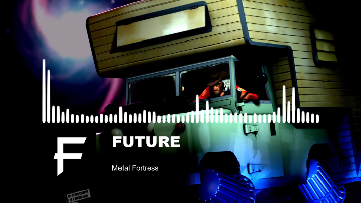
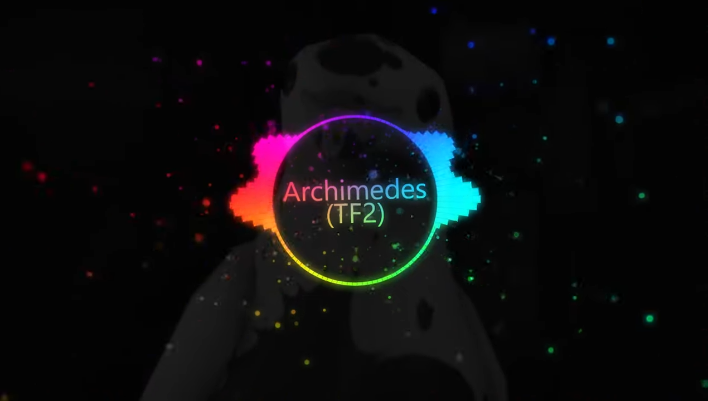
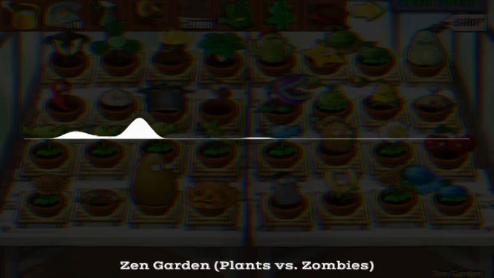
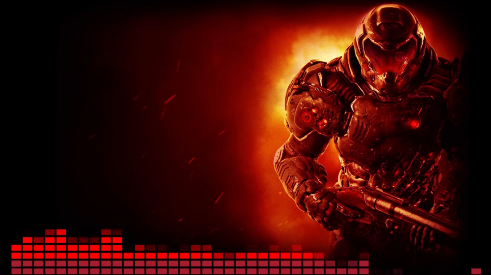

# Video Editing

[Home](howto.md)

<!--toc:start-->
- [Video Editing](#video-editing)
    - [Basic video editing - Hitfilm Express](#basic-video-editing-hitfilm-express)
    - [Effects](#effects)
        - [Hitflim Express example](#hitflim-express-example)
    - [Free alternatives](#free-alternatives)
        - [Avee Player example](#avee-player-example)
    - [Astrofox](#astrofox)
        - [Astrofox example](#astrofox-example)
    - [Shotcut](#shotcut)
        - [Shotcut visualizer example](#shotcut-visualizer-example)
    - [Deprecated video editing tools:](#deprecated-video-editing-tools)
<!--toc:end-->

On this page, I would like to show how I edit my videos and which apps I use. I also explain how I make my audio visualizer.

### Basic video editing - Hitfilm Express

At the moment, I am using Hitfilm Express, since 2020. Hitfilm Express is the free version of Hitfilm itself, and the cool thing about it is that it lets you choose whichever plugins and effects you need for your edits. Since I am doing music videos, I bought the Audio FX Expansion, which is the visualizer you can see in most of my recent videos.

In Hitfilm, you can create a visualizer by dragging any audio file into the project media folder. Then you need to create a composite shot, which is basically a group of layers. Here you can drag in the audio, add the audio FX, and include some text as well. Drag the audio first, then the audio plugin so you can find it under Effects > Audio Input > choose Song. Once you have done that, it automatically creates the visualizer for you, and now you can start tweaking.

### Effects

Besides the audio plugin, my most common effects are Contrast, Vignette, and sometimes Blur and Shake. The shake effect makes the visuals a bit less static when the beats drop. The blur effect can sometimes look pretty modern too. Contrast is my usual effect for years now. I have a dark room with bad natural light, so contrast can hide those spots better. Vignette adds a nice touch alongside the contrast.

##### Hitflim Express example

### Free alternatives

**Avee Player** is a great Windows UWP app that also runs on the phone. It lets you create a visualizer with many different options, which makes it a bit complicated at first. There are some presets you can use for basic effects though. You only need to change the song and add some text or a background. I would have used it all the time, because the presets let you create a visualizer quickly—but for some reason, the sound of the rendered videos has crackling noises. It also lets you render the videos at 30 FPS in the current version. Because of that reason, I stopped using it for now.

##### Avee Player example

  
### Astrofox
**Astrofox** is a free and open-source alternative to Avee Player. It is still in development and currently has far fewer features. You can only choose from a handful of effects and visualizers, and there are fewer ways to customize them. The interface is also not very intuitive yet. However, if simple visualizers are enough, Astrofox is a great choice. Hopefully, we will see new improvements soon.

##### Astrofox example

### Shotcut

Shotcut is another free and open-source alternative for video editing software. In my opinion, Shotcut is one of the best alternatives out there, and it is being developed by a community. The good thing besides being free is the amount of effects and options. The first thing you will probably notice is performance—no matter how fast your computer is. That is something you need to get used to over time. That does not mean that if you edit 4K files, you automatically end up in lag hell: you can improve that by using the proxy function, which basically creates smaller files from the original for a smoother edit. I also recommend Shotcut if you quickly want to trim or render something. It is perfect for that. I already used it as a “lazy” replacement for Hitfilm when my video was only about edits. For audio visualizers, you have one effect here, but in my opinion, it clearly does not look as good as it does in Hitfilm.

##### Shotcut visualizer example

### Deprecated video editing tools:

The first video tool was Sony Vegas Movie Studio 9, later version 11. It was my main editing tool and it worked quite well. I still recommend the recent versions because they are easy to use and beginner-friendly. The number of effects was enough to make a good video edit—if you focus on making multiple scenes of yourself playing, then it is enough anyway. What bothered me after a while were the small hiccups it had. Sadly, it was also one of the more unstable apps I used. Always hit CTRL+S! For a while, I was also using Sony Vegas Pro Edit 14. I got it as part of a humble bundle for cheap, but the Edit version was not even better than the Movie Studio version.
